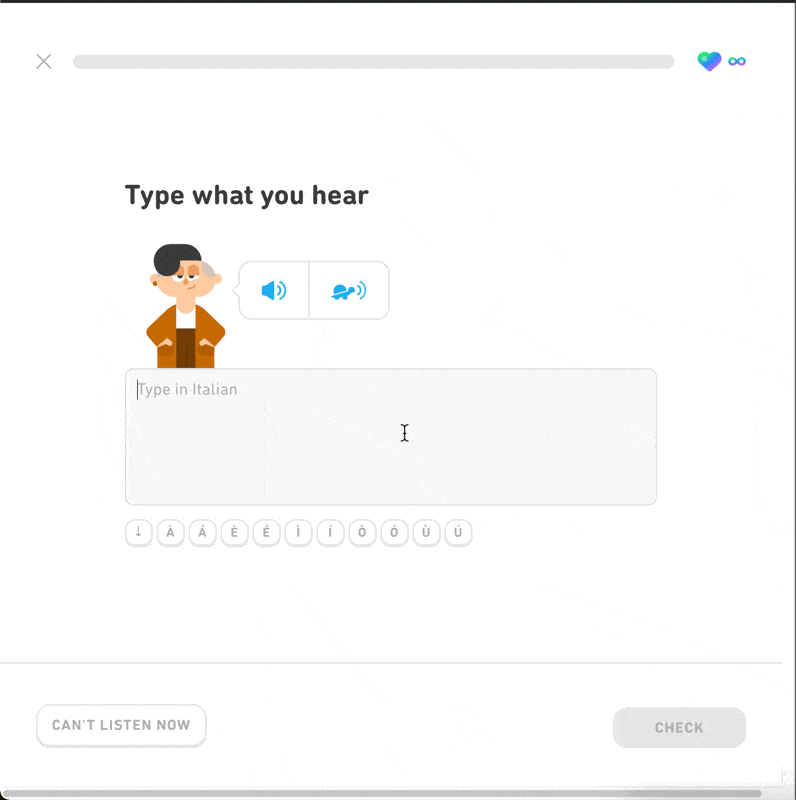

# Duolingo Accents Extension

Do you use Duolingo on a computer and constantly forget how to type accents?

I'm here to help! Since you're about to click on the button anyway this extension will
help create a simple little tooltip to remind you how to use the keyboard to type out
that character. Perhaps after seeing the tooltip enough you'll just remember the
key codes and uninstall the extension completely. Happy Learning!

# Developing Locally

1. Clone the Repo
2. Open Chrome Extension manager (or Brave)
3. Select "Load Unpacked Extension"
4. Browse to pages within the duolingo.com/\* domain for the extension to activate.
5. Install [Advanced Extension Reloader](https://chromewebstore.google.com/detail/advanced-extension-reload/hagknokdofkmojolcpbddjfdjhnjdkae?hl=en) to help with reloading the extension after you make changes. This prevents the need to go through steps 2+3.

# Publishing

(TODO) This extension is not currently published, if you want you use it you will
need to download the code and follow directions in [Developing Locally](#developing-locally)

**\*** This tool is a personal project of mine. I am not affiliated with Duolingo, their product or engineering teams.
This tool has not been endorsed by Duolingo.
